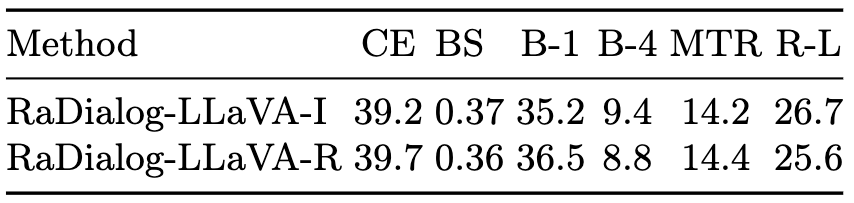
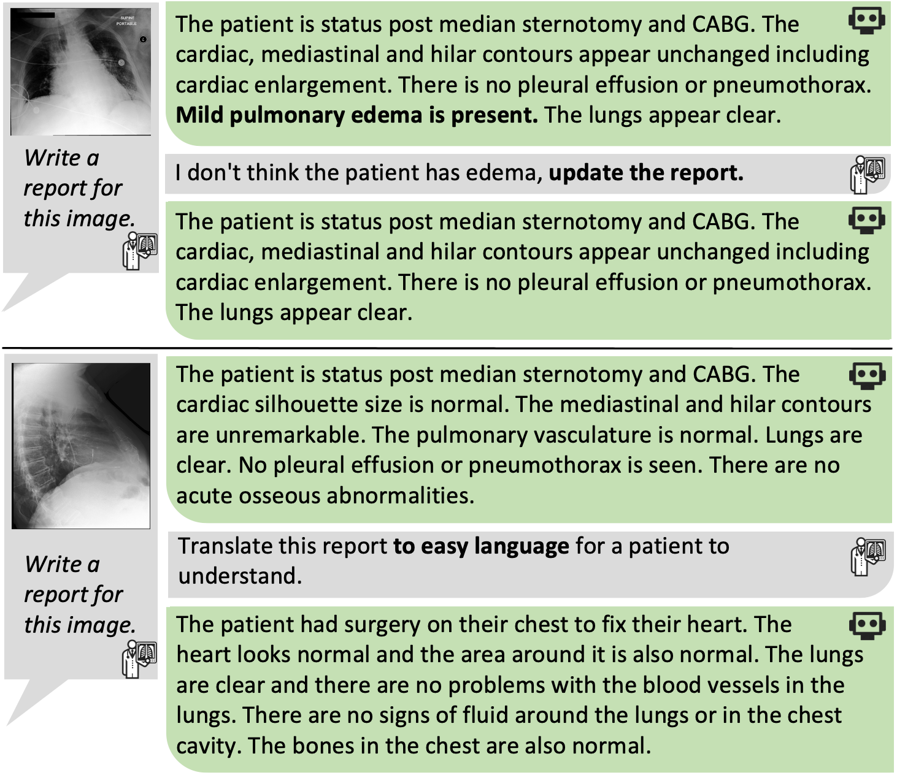

## RaDialog-LLaVA

[](https://arxiv.org/abs/2311.18681) [](https://physionet.org/content/radialog-instruct-dataset/1.0.0/) [](https://huggingface.co/ChantalPellegrini/RaDialog-interactive-radiology-report-generation)

RaDialog-LLaVA is the improved version of the original RaDialog model which can be found on [Github](https://github.com/ChantalMP/RaDialog/tree/master) and [Arxiv](https://arxiv.org/abs/2311.18681).
It follows the same concepts, including the same image encoder, chexbert classifier, prompt construction and language model. However, we followed the LLaVA methodolgy for image-text alignment, leading to improved conversational assistance and making the model easier use.
The main differences are the following:

- image projection: instead of the BLIP-inspired alignment module, we follow the LLaVA approach and use a simple MLP projection to project the image
  features to the language model input size, leading to more image tokens.
- the image encoder is fine-tuned during LLM training
- the model was trained on an updated version of the RaDialog-Instruct dataset with three additional instruct tasks: impression generation, view
  classification and Rad-ReStruct QA

#### RaDialog-LLaVA main results:



**✨ News ✨**

- 29 May 2024: RaDialog-LLaVA is now available on [Hugging Face](https://huggingface.co/ChantalPellegrini/RaDialog-interactive-radiology-report-generation)

---



Conversational AI tools that can generate and discuss clinically correct radiology reports for a given medical image have the potential to transform
radiology. Such a human-in-the-loop radiology assistant could facilitate a collaborative diagnostic process, thus saving time and improving the
quality of reports. Towards this goal, we introduce RaDialog, the first thoroughly evaluated and publicly available large vision-language model for
radiology report generation and interactive dialog. RaDialog effectively integrates visual image features and structured pathology findings with a
large language model (LLM) while simultaneously adapting it to a specialized domain using parameter-efficient fine-tuning. To keep the conversational
abilities of the underlying LLM, we propose a comprehensive, semi-automatically labeled, image-grounded instruct dataset for chest X-ray radiology
tasks. By training with this dataset, our method achieves state-of-the-art clinical correctness in report generation and shows impressive abilities in
interactive tasks such as correcting reports and answering questions, serving as a foundational step toward clinical dialog systems.

## Getting Started with RaDialog-LLaVA

To test RaDialog and use it for inference, follow the instructions in our huggingface
repository [here](https://huggingface.co/ChantalPellegrini/RaDialog-interactive-radiology-report-generation).

For more detailed instructions on how to train and evaluate RaDialog, please refer to the instructions below.

## Repository Installation

### Environment Setup:

#### 1) RaDialog Environment

- clone this repository and move to the radialog directory with `cd RaDialog_LLaVA`
- Install the RaDialog environment with `conda create --name radialog python=3.10`
- Activate the environment with `conda activate radialog`
- `conda install pytorch==2.0.1 torchvision==0.15.2 torchaudio==2.0.2 pytorch-cuda=11.7 -c pytorch -c nvidia`
- `pip install -r requirements.txt`
- Install java and set JAVA_HOME and PATH in local_config.py (we used jre1.8.0)
- install flashattention following https://github.com/Dao-AILab/flash-attention

#### 2) CheXbert Environment (only needed for CheXbert score evaluation)

- Install the CheXbert environment with `conda create --name chexbert python=3.7`
- Activate the environment with `conda activate chexbert`
- Move to the chexbert directory with `cd chexbert`
- Install the requirements with `pip install -r requirements.txt`
- Set the absolute path to the chexbert env and folder in `RaDialog_LLaVA/local_config.py`
- Download chexbert.pth from [here](https://github.com/ChantalMP/RaDialog/releases/tag/weights) and place it in in
  RaDialog_LLaVA/chexbert/src/checkpoint/

### Prepare Data

#### 1) Download the RaDialog-Instruct dataset

The updated dataset is currently under review at PhysioNet and will be available soon. In the meantime, you can use the previous version of the
dataset by following the instructions below:

- Download the instruct dataset from [PhysioNet](https://physionet.org/content/radialog-instruct-dataset/1.0.0/)
- unzip it place it in RaDialog_LLaVA/data/
- in train.sh set the path to the instruct dataset (e.g. --data_path home/RaDialog_LLaVA/data/mimic_cxr_instruct_stratified.json)

#### 2) Download MIMIC-CXR

- Download the MIMIC-CXR-JPG dataset from [here](https://www.physionet.org/content/mimic-cxr-jpg/2.0.0/)
- The dataset should be saved in .../physionet.org/files/mimic-cxr-jpg
- Go to physionet.org/files/mimic-cxr-jpg/files/ and unzip mimic-cxr-2.0.0-split.csv.gz
- from [here](https://physionet.org/content/mimic-cxr/2.0.0/), dowload mimic-cxr-reports.zip
- unzip it and place the folder in the same directory as the MIMIC-CXR-JPG dataset (e.g. physionet.org/files/)
- in local_config.py set the path to the MIMIC-CXR dataset (e.g. .../physionet.org/files/)
- in model/lavis/defaults_report.yaml set the path to the MIMIC-CXR-JPG dataset (e.g. .../physionet.org/files/mimic-cxr-jpg/2.0.0 )

#### 3) Create sectioned report data

- go to the mimic-cxr folder in the code with `cd mimic-cxr`
- run `python create_section_files.py` to prepare the report data
- go back to the RaDialog_LLaVA directory with `cd ..`

### Evaluate RaDialog on MIMIC-CXR test set:

- RaDialog-INS:
  run `python -m test --prompt img_matching_examples_ig2_noexamples_IMG_findings --split "test" --vision_tower biovil`
- RaDialog-INS (downstream tasks):
  add `--do_corr`, `--do_cp_bin_qa`, `--do_cp_all_qa`, `--do_view_class` or `--do_impression` respectively to the command above

### Train RaDialog:

#### 1) CheXbert classifier Training

- run `python -m findings_classifier.chexpert_train --train --run_name "train_chexbert"`
- in chexpert_train.py set ckpt_path (line 152) to the path of the model you just trained
- then run `python -m findings_classifier.chexpert_train --run_name "save_preds"` to save the predictions of the trained model

#### 3) LLM Training

- move to LLaVA directory with `cd LLaVA`
- in train.sh set PYTHONPATH to the path of the RaDialog_LLaVA directory
- run ./train.sh to start training the model
- we used checkpoint-21000

### Demo

#### Demo Environment

- Install the RaDialog demo environment with `conda create --name radialog_demo python=3.10`
- Activate the environment with `conda activate radialog_demo`
- `conda install pytorch==2.0.1 torchvision==0.15.2 torchaudio==2.0.2 pytorch-cuda=11.7 -c pytorch -c nvidia`
- pip install -r requirements_demo.txt

#### Run Demo:

- run `python demo.py` to start the demo
- connect to the demo with a browser at `http://127.0.0.1:7861` and start chatting with RaDialog
- 

## Reference
When using our model (original and LLaVA version) or dataset, please cite:

```
@article{pellegrini2023radialog,
  title={RaDialog: A Large Vision-Language Model for Radiology Report Generation and Conversational Assistance},
  author={Pellegrini, Chantal and {\"O}zsoy, Ege and Busam, Benjamin and Navab, Nassir and Keicher, Matthias},
  journal={arXiv preprint arXiv:2311.18681},
  year={2023}
}
```
